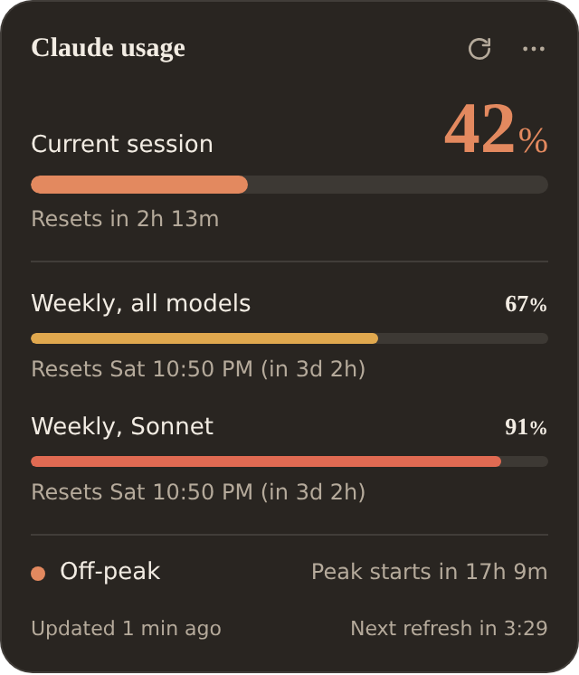
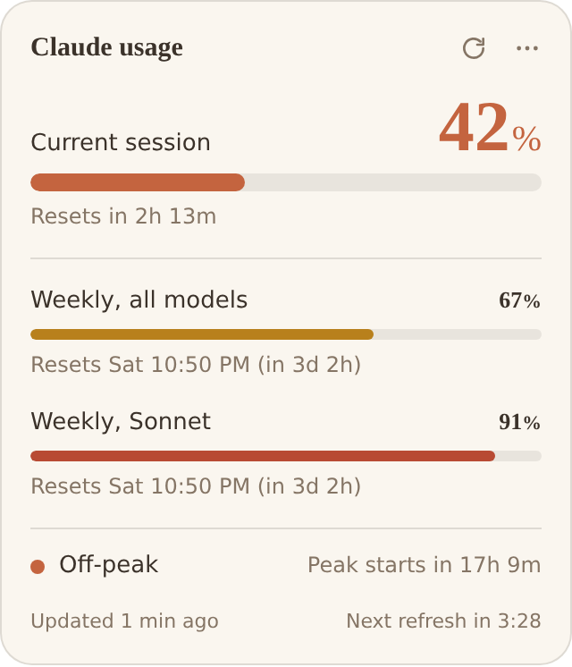

# Usage Meter for Claude

A small desktop widget for Windows (and macOS, in preview) that shows how much of your Claude plan you have used, when each limit resets, and whether Claude's peak hours are on right now.

It works with Free, Pro and Max accounts. The widget shows whichever limits claude.ai reports for your account: the 5-hour session, the weekly limit, and any per-model weekly limits.

<p>
  
  
</p>

> Not affiliated with or endorsed by Anthropic. "Claude" is a trademark of Anthropic.

## What it shows

- **Current session** (the 5-hour window): percent used and time until it resets.
- **Weekly limits**: every weekly bar your account has, each with its reset day and countdown.
- **Peak hours**: whether peak hours are active, a countdown to the next change, and a strip showing today's peak window in your local time. The schedule is Monday to Friday, 13:00 to 19:00 UTC, as published on [claude-peak-time.pages.dev](https://claude-peak-time.pages.dev/). Turn it off from the menu if it doesn't apply to your plan.

Your claude.ai chats, the Claude desktop app and Claude Code all draw from the same limits, so these numbers cover all of them.

## Refreshing

- The widget refreshes every 5 minutes by default. Change this from the menu under **Refresh every** (1 to 30 minutes).
- Click the refresh button to refresh immediately. The next automatic refresh then happens a full interval after your manual one, so a manual refresh always restarts the countdown.
- The footer shows when the data was last updated and when the next refresh is due.

## Install

Download the latest installer from [Releases](../../releases), or get it from the Microsoft Store (once published).

**"Windows protected your PC"?** Windows shows this for new apps whose installer isn't signed yet or hasn't built up a download history. Click **More info**, then **Run anyway**. The Microsoft Store version doesn't show this warning. See [Code signing](#code-signing) for the plan.

On first launch, click **Sign in**. claude.ai opens in its own window once its page has loaded, and the window closes on its own once you're signed in.

It's a desktop widget: it sits on your desktop, above the wallpaper and icons and below every app window. Open windows cover it, just like desktop icons, and pressing **Win+D** (Show desktop) brings it into view. It doesn't appear in the taskbar or in Alt+Tab.

The widget sizes itself to what your account shows: it is exactly as tall as its content and just as wide, so it's a square with the same even spacing on every plan. Accounts with more limits get a bigger square. To make the whole widget bigger, for example on a large monitor, drag its bottom-right corner (double-click the corner to go back to 100%), or use **Settings → Appearance → Size**. Like a desktop icon, it sits on your icon grid: drag it by its title and it snaps to the nearest tile when you let go. It remembers where you put it.

Click the `⋯` button on the widget, or right-click the tray icon, for **Refresh now**, **Settings**, **Hide widget** and **Quit**. Clicking the tray icon hides or shows the widget.

### macOS (preview)

A Mac version is built from the same code. It hasn't been tested on a physical Mac yet: it is built and smoke-tested on GitHub's macOS runners, so treat it as a preview and please [report problems](../../issues).

- Download the `.dmg` for your Mac from [Releases](../../releases): `arm64` for Apple Silicon (M1 and later), `x64` for Intel. Open it and drag the app to Applications.
- The app isn't signed by Apple yet, so macOS blocks it the first time. Open **System Settings → Privacy & Security**, scroll down, and click **Open Anyway** next to the message about Usage Meter for Claude. If macOS says the app "is damaged", run `xattr -cr "/Applications/Usage Meter for Claude.app"` in Terminal, then open it again.
- The widget sits on the desktop above your icons and below your windows, on every Space. Mission Control and Show Desktop leave it in place. It has no Dock icon and isn't in Cmd+Tab; use the menu bar icon instead.
- It snaps to a 96 × 96 grid. Matching your own Finder grid spacing is planned.
- **Open at login** in Settings works the same as Start with Windows.

## Settings

Open **Settings** from the `⋯` menu or the tray icon. Everything is there, no files to edit:

- **General:** how often to refresh (1 to 30 minutes), whether to show peak hours, and whether to start with Windows.
- **Appearance:** style (Cozy, with warm colours and serif numbers, or Classic), theme (System, Dark or Light), accent colour, background opacity, size (80% to 250%), and resetting the widget's position.
- **Account:** sign in or out, choose the organization to show if your account has several, and open claude.ai.
- **About:** version and a link to this repository.

## Custom CSS (for developers)

If you want to change more than Settings offers, choose **Settings > Appearance > Custom CSS > Open CSS file**. That opens your personal `theme.css`, which loads after the built-in styles and your Settings choices. Save it and the widget updates within a second.

Most changes only need a variable:

```css
:root {
  --bg: rgba(30, 20, 45, 0.92);   /* panel background (overrides theme and opacity) */
  --ok: #7dd3fc;                  /* bar colour under the warning threshold */
  --warn: #fbbf24;                /* bar colour from 60% */
  --danger: #fb7185;              /* bar colour from 85% */
  --radius: 22px;                 /* corner rounding */
  --hero-size: 40px;              /* size of the session percentage */
}
```

| Variable | What it changes |
| --- | --- |
| `--bg`, `--border`, `--radius`, `--pad` | Panel background, outline, corner rounding, inner spacing |
| `--font`, `--font-numbers` | Text font and the font used for percentages |
| `--text`, `--muted` | Main text and secondary text colours |
| `--hero-size` | Size of the session percentage |
| `--track`, `--bar-height`, `--hero-bar-height` | Bar background and bar thickness |
| `--ok`, `--warn`, `--danger` | Bar colours by level |
| `--peak`, `--off-peak` | Peak-hours dot and strip colours |

You can also restyle any element, for example `.peak { display: none; }` or `.footer { opacity: 0.6; }`. To go back to the default look, empty the file.

The file lives in `%APPDATA%\Usage Meter for Claude\theme.css` (Store builds keep it inside the app's package folder, so use the Settings button to find it). Share themes by sharing that file. Other settings are stored next to it in `config.json`; `warnAt` and `dangerAt` there set the bar colour thresholds in percent.

## How it works

claude.ai has a private endpoint that powers its own Usage page:

```
GET https://claude.ai/api/organizations/<org_id>/usage
```

The widget keeps your claude.ai sign-in in its own browser profile (an Electron session partition), like a separate browser. A hidden window on the claude.ai origin calls that endpoint, so requests behave like a normal browser tab.

The response includes a `limits` list. Each entry has a group (`session` or `weekly`), a percent, a reset time and, for limits that apply to one model or product, a name supplied by claude.ai (for example "Cowork"). The widget draws one bar per entry, so every plan, and any new model or product limit, shows up without code changes. If the list is missing or empty, the widget falls back to the older `five_hour` and `seven_day_<name>` keys. Other keys in the response are ignored.

### Accounts with more than one organization

Many people belong to several organizations, such as a personal plan and a work or university Enterprise seat. Each one has its own limits, so the widget never guesses:

- With **one** claude.ai organization, the widget shows it straight away.
- With **two or more**, the widget asks which one to show and remembers the choice. The organization currently selected on claude.ai is marked to help you pick. Change it later under **Organization** in the menu. The chosen organization's name appears under the widget title.
- API-only organizations (Claude Console accounts) have no session or weekly limits, so they are never listed.
- If you leave the chosen organization, the widget asks again. Signing out clears the choice.

Everything that differs between operating systems lives in `src/main/platform/`, behind one small interface described in `platform/index.js`. All claude.ai logic lives in `src/main/claude.js`, and response parsing lives in `src/shared/core.js`. If claude.ai changes its endpoints, those are the files to fix. `test/fixtures/` holds real responses for the tests.

### Privacy

- Your session stays on your computer, in the widget's own profile. Sign out from the menu to delete it.
- The widget only talks to claude.ai. No analytics, no telemetry, no third-party servers.
- The code is small and open; read it.

### Known limits

- The widget lines up with your desktop icons by asking the desktop for its icon spacing. If your icons use auto-arrange with unusual spacing, the grid may be a few pixels off; Settings > About shows the tile size it detected.
- Staying on the desktop layer uses standard Windows calls (`SetWindowPos` and friends, through the prebuilt [koffi](https://koffi.dev) library) because Electron has no setting for it. If those calls are unavailable, the widget behaves like a normal window instead. To see what it detects, run it with `$env:USAGE_METER_DEBUG_DESKTOP=1; npm start`.

- The endpoint is undocumented and can change without notice. When it does, the widget shows an error instead of wrong numbers.
- If claude.ai shows a browser check, choose **Open claude.ai** from the menu, let the page load, then refresh.
- Some sign-in providers are strict about embedded browsers. If Google sign-in is refused, use the email option on the claude.ai sign-in page.

## Develop

Requires Node.js 20 or newer.

```bash
npm install
npm start      # run the widget
npm test       # logic tests and a syntax check of every source file
```

Project layout:

```
src/
  main/
    main.js              app lifecycle, widget window, tray menu, refresh scheduling
    claude.js            sign-in window and claude.ai requests
    config.js            settings file
    preload.js           the small API the widget and Settings pages can call
    theme-template.css   copied to the user's custom CSS file on first run
    platform/
      index.js           picks the implementation for the current OS
      windows/           desktop layer, icon grid and Windows API calls
      mac/               desktop window level, Dock hiding and menu bar icon for macOS
      fallback/          plain-window behaviour for other systems
  renderer/
    index.html           widget markup
    styles.css           built-in styles (all values are CSS variables)
    renderer.js          rendering and live countdowns
    settings.html        the Settings window (with settings.css and settings.js)
  shared/
    core.js              pure logic: peak hours, usage parsing, grid snapping, desktop placement, refresh scheduler
test/
  core.test.js           logic tests, platform interface checks, and a syntax check of every source file
  fixtures/              real claude.ai usage responses used by the tests
```

`src/shared/core.js` has no dependencies and is loaded by both the main process and the widget, so the tests cover the same code the app runs.

## Build installers

```bash
npm run dist         # dist/Usage Meter for Claude Setup <version>.exe, for GitHub Releases
npm run dist:store   # dist/*.appx, for the Microsoft Store
npm run dist:mac     # dist/*.dmg for Apple Silicon and Intel (needs a Mac)
```

The `macOS` GitHub Actions workflow builds the Mac app on every pull request that touches the app, launches it on a real Mac runner, checks that it pins itself to the desktop layer, and uploads the `.dmg` files, the app log and a screenshot as a build artifact. When a release is published, it attaches the `.dmg` files to that release.

### Code signing

Windows SmartScreen warns about installers that aren't signed, and about signed installers that haven't been downloaded enough times yet to build a reputation. The options, cheapest first:

| Option | Cost | Removes the warning? |
| --- | --- | --- |
| Microsoft Store | Free for individual developers | Yes. The Store signs the package, so Store installs show no warning. |
| SignPath Foundation | Free for open-source projects that qualify | Gradually. Installers are signed by "SignPath Foundation"; the warning fades as downloads build reputation. |
| Azure Artifact Signing (formerly Trusted Signing) | About $10 a month; individuals in the US and Canada | Gradually, same as above. |
| OV certificate from a certificate authority | Roughly $150 to $300 a year | Gradually, same as above. |

On macOS, the equivalent is Gatekeeper, which blocks unsigned apps until the user approves them in System Settings. Removing that needs an Apple Developer Program membership (paid yearly) to sign and notarize the app.

The plan for this project: publish to the Microsoft Store for a warning-free install, and apply to SignPath Foundation for the GitHub installer once the project has some history.

### Publishing to the Microsoft Store

1. Create a Microsoft Partner Center developer account and reserve the app name.
2. In Partner Center, open **Product identity** and copy the package identity name, publisher ID (`CN=…`) and publisher display name into the `build.appx` section of `package.json`.
3. Run `npm run dist:store` and upload the `.appx` from `dist/`. The Store signs it for you.
4. Store tiles come from `build/appx/`. Replace those PNGs with your own artwork if you like.
5. In the listing, say clearly that the app is not affiliated with Anthropic.

In Store builds, "Start with Windows" is managed by Windows (Settings > Apps > Startup), so that setting is disabled there.

Before your first release, replace `REPLACE_WITH_YOUR_GITHUB_USERNAME` in `src/main/main.js` with your GitHub username so **About and source code** opens your repo.

## Verify a build

1. `npm test` passes (54 tests).
2. `npm start`, then sign in. The sign-in window appears once claude.ai has loaded, with no black screen. If your account has several organizations, pick one. The session, weekly and peak sections appear, and the footer counts down from "Next refresh in 5:00".
3. Drag the widget a little and let go. It snaps to the same grid as your desktop icons.
4. Click the widget, then click the desktop, then an app. The widget never disappears, not even briefly, and stays behind app windows. Press Win+D: the widget is visible.
5. Open **Settings**. Switch the style between Cozy and Classic, and change the theme, accent and opacity: the widget updates straight away. Switch organization under Account: the widget shows that organization.
6. Check the widget is square with even spacing: the gap above the title matches the gap below the footer, with no empty band anywhere. Drag the bottom-right corner: the whole widget grows and stays square. Double-click the corner: it goes back to 100%.
7. Click refresh. The footer jumps back to about "Next refresh in 5:00".
8. Choose **Sign out** in Settings > Account. The widget asks you to sign in again.

## Contributing

Contributions are welcome. Read [CONTRIBUTING.md](CONTRIBUTING.md) before opening a pull request, and report security issues privately as described in [SECURITY.md](SECURITY.md).

## License

[MIT](LICENSE)
